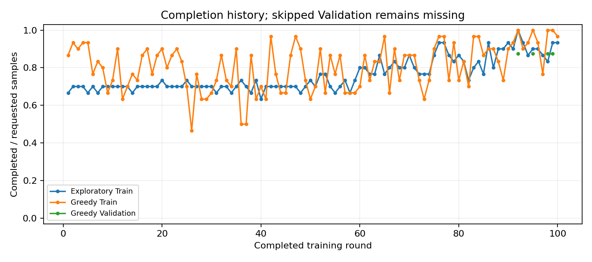
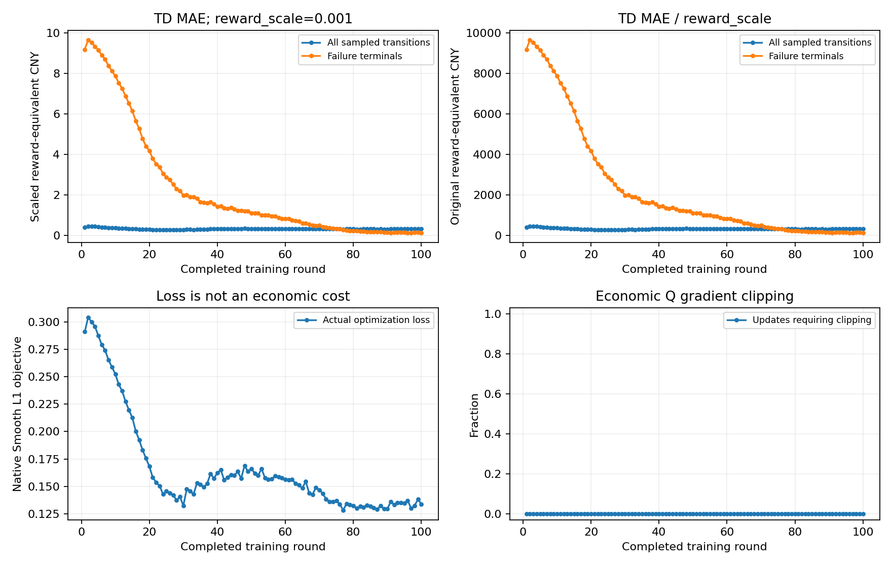
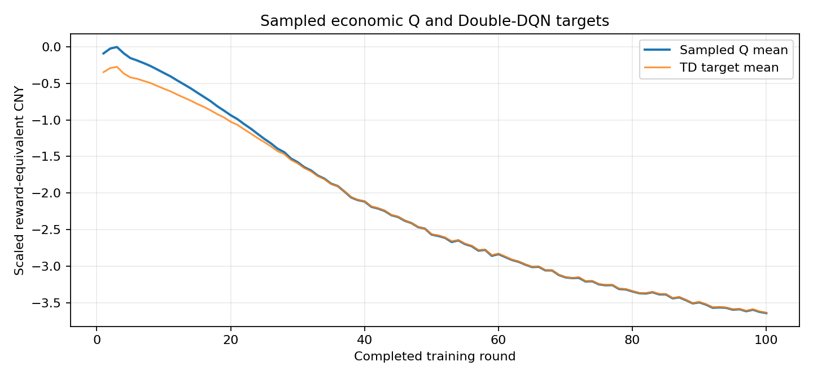
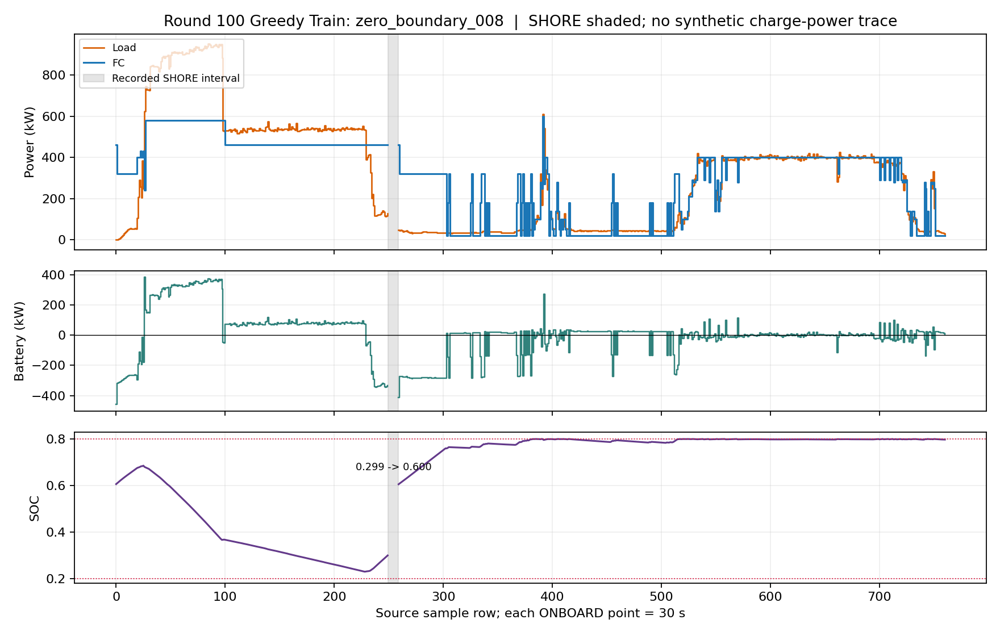
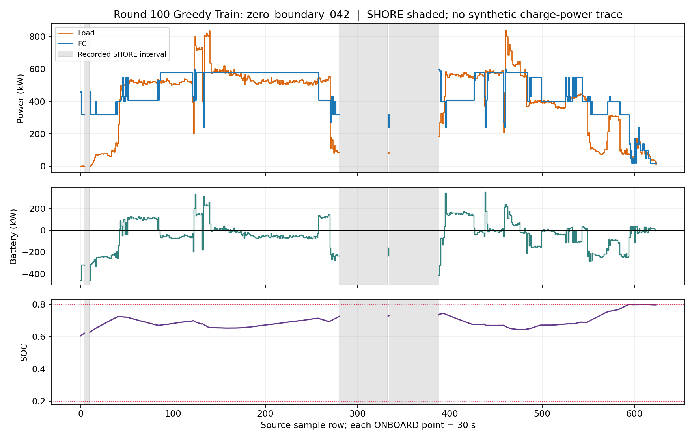
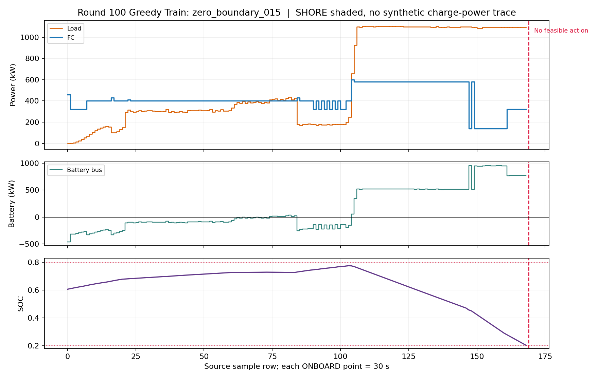

# v4 直接功率 Double DQN 100 轮正式训练分析

分析日期：2026-10-10。仅分析 `outputs/v4_economic_ddqn_100r_seed42_20261010_123856/`；本报告附有该次运行的 [元数据](results/v4_100r_training_analysis/run_metadata.json)、[逐轮 CSV](results/v4_100r_training_analysis/round_metrics.csv)、[完整报告](results/v4_100r_training_analysis/report.json)和[日志](results/v4_100r_training_analysis/train.log)。`round_history.json` 与 `report.json` 的 SHA256 相同，因此只归档后者。没有读取 Test、重新训练或重新执行 Greedy 策略。第 100 轮轨迹只按样本和 transition 流式读取，以下局部曲线均来自已保存的动作记录。

## 1. 运行完成情况与模型资格

`report.json` 标记 `run_status=completed`、`completed_training=true`，包含 1–100 共 100 轮；`round_metrics.csv` 也有 100 行。源码提交为 `5c670fd124a7333ac8343925889453f7cd7ab9c9`，最终数据 manifest 与开跑时相同，`test_payloads_opened=0`。训练曾在第 62 轮写入 JSON 时因内存错误中断，随后从第 61 轮完整 checkpoint 恢复；最终日志结束于第 100 轮的 MONITOR 记录。

| 项目 | 实际记录 |
|---|---:|
| 训练环境 transition | 1,418,359 |
| 预填充环境 transition | 18,273 |
| 经济 replay 累计新增 | 1,436,632；FIFO 容量 300,000 |
| 经济 Q 优化 | 44,894 次，其中预填充 571、正式轮次 44,323 |
| Target 初始化复制／逐次软更新 | 1／44,894 次 |
| 第 100 轮探索 ε | 0.05；Greedy 评估 ε=0 |
| 第 100 轮 Exploratory / Greedy Train | 28/30、29/30 |
| 合格模型 | **无**：`best_agent.pt` 不存在，`best_checkpoint=null` |

完整的 `training_state_latest.pt` 保存在原输出目录，标记完成第 100 轮且 ZIP 完整性检查通过；它是续训状态，**不是经 Train 和 Validation 双重筛选的最优模型**。文件约 142 MB，未收入 Git 普通归档。逐轮大型轨迹也保留在原输出目录；Git 归档包含原始指标、报告、日志及有限代表性图表，不冒充完整训练状态备份。参数以元数据为准：8–128–128–61 MLP、FC 0–600 kW/10 kW、Adam `1e-4`、batch 64、γ=1、8-step、Huber δ=1、`reward_scale=0.001`、replay32、Target `tau=0.001`、失败终止 batch 配额 2、失败惩罚倍率 1、`beta_soc=0`、电池价值奖励重分配关闭、seed 42、控制周期 30 s。该次运行保留 Scheme A 策略候选门控及固定 SOC 0.6 模型岸电补能。

## 2. 完成率与数值学习

| 轮次范围 | 探索 Train 平均完成数 | Greedy Train 平均完成数 | Greedy Train 范围 |
|---|---:|---:|---:|
| 1–10 | 20.7/30 | 25.1/30 | 20–28 |
| 21–40 | 20.9/30 | 21.6/30 | 14–27 |
| 61–80 | 24.7/30 | 24.7/30 | 19–29 |
| 91–100 | 27.2/30 | 28.3/30 | 23–30 |

Greedy Train 首次 30/30 出现在**第 92 轮**，另见第 95、98、99 轮。这四轮才执行 Validation，结果均为 **7/8**；每次失败的都是 `zero_boundary_036`，分别在原始行 154、140、157、154 发生 SOC 受限的无可行动作。Validation 从未达到 8/8，因此没有完整 Validation 经济费用可比较，也没有合格 best checkpoint。四个 Train 30/30 轮次的完整 Train 模型口径费用分别为 202,640.96、156,256.62、170,472.65、162,269.99 元；它们也未通过 Validation。第 100 轮仅 29/30，其完成样本费用**不能**与上述 30/30 费用直接比较。

第 1→100 轮，整体 TD MAE 为 0.387→0.312，失败终止 TD MAE 为 9.181→0.123，Huber loss 为 0.291→0.134；这些数值是 **0.001 缩放后的训练奖励单位**，不是人民币成本。第 100 轮整体 TD MAE 换算为约 311.96 原奖励等价单位。采样 Q 均值从 -0.090 移至 -3.643，目标均值从 -0.346 移至 -3.638；第 100 轮采样 Q 范围 -11.013 至 -0.109，没有看到数值爆炸。不同轮次的 replay 采样状态分布会变化，故 Q 均值移动不能当作同一状态价值收敛的证明。梯度裁剪阈值 10，逐轮记录的裁剪次数均为 0。Q 和目标均值靠拢、失败终止 TD 误差下降，说明相应样本的拟合改善；**它们没有使 Validation 完成 8/8**。Greedy 完成率在训练中段明显下降，后期回升，第 99→100 轮仍从 30/30 降到 29/30，不能称为稳定收敛。

固定合成状态的第 100 轮 Q 诊断在 `low_soc_load300`、`working_soc_load600`、`high_soc_load100` 分别首选 460、550、320 kW；这些探针不是 `_015` 或 `_036` 的实际决策状态。此次未启用实际状态诊断 checkpoint，因而**没有当时逐动作 Q 排名**可证明 `_015` 的低 FC 动作源于哪一种 Q 估计误差。

## 3. 第 100 轮功率分配、SOC 与岸电

以下是第 100 轮 Greedy Train **30 个样本已执行前缀**的诊断，不是合格策略评价：共 18,280 个 ONBOARD 动作，FC 平均 250.90 kW、零功率占 9.17%，相邻动作平均绝对变化 28.90 kW，最大变化 600 kW；约 28.40% 的步存在非零变载。已执行前缀记录 82 次 FC 启动：按样本起点与模型岸电边界分解为 74 次出航启动、8 次 ONBOARD 内部重启。后 8 次均发生在先前物理掩码只剩 0 kW 的受迫停机之后。航行期 SOC 平均 0.741；SOC≥0.79 占 48.75%，SOC<0.4 占 1.67%。全部已执行 SOC 在 [0.2,0.8] 内；失败样本终止前最低为 0.2021，但下一步没有合法动作。已完成航段的末端 SOC 平均约 0.789，显示大量时间接近上限。

流式核对第 100 轮 30 个 Train 样本的动作掩码：SOC≥0.79 且 FC=0 的 **1,676 步全部没有正功率物理可行动作**；整轮没有“存在正功率物理可行动作却主动选 0 kW”的记录。轨迹中的 `delayed_or_continued_off` 标签不能单凭名称解释为 DQN 主动停机，必须联看物理掩码。这一现象说明高 SOC、低负载与当前电池充电/SOC 上限共同限制 FC 出力；不能把所有 FC=0 都归咎于 Q 网络。

`zero_boundary_008` 原始行 [250,259) 是已记录的 SHORE 模式区间。对应上一个 ONBOARD 动作后的 SOC 为 0.299，下一次出航前为 0.600；图中灰色区间是**原始工况时段**，没有画出虚构的 30 s 充电功率。其模型岸电电费约 217.59 元。FC 在若干负载区间保持平台输出，电池承担差额；后半段 SOC 长时间贴近 0.8，FC 受低负载约束频繁降至低功率。

`zero_boundary_042` 的最大相邻 ONBOARD 负载跳变约 597.89 kW；FC 在部分中负载阶段保持约 580 kW，电池承担剩余差额，但也存在明显 FC 阶跃。其原始 SHORE 区间为 [5,10)、[281,333)、[335,388)，三次抵港 SOC 均不低于 0.6，因此模型不充电、不强制放电。第 100 轮全部 44 个样本内 SHORE 边界均有后续 ONBOARD；其中 5 个 SOC<0.6 的边界执行固定目标补能，44 次跨岸电后的出航 SOC 均等于 `max(抵港 SOC,0.6)`（浮点误差小于 1e-9）。这核对的是**冻结模型的状态连续性**，并不能证明现实中实际接入岸电或靠港时间足够充电。

## 4. 经济账本与主要成本

第 100 轮只有 29 个 Train 样本完整完成，以下仅描述这 **29 个固定样本集合**，不作为全 30 样本的策略经济成绩。四项合计 156,189.93 元，其中 ONBOARD 已执行账本 154,485.10 元，模型化固定目标岸电结算 1,704.83 元，末端 MODELED terminal settlement 为 0。原始 SHORE 电表交易未被验证；表中的“岸电”是模型购电情景。

| 四项成本 | 29 个完成样本，元 | 占模型口径总成本 |
|---|---:|---:|
| 氢耗 | 43,893.35 | 28.10% |
| FC 退化（含模型岸电停机变载） | 109,398.13 | 70.04% |
| 电池退化（含模型充电） | 2,476.69 | 1.59% |
| 模型岸电购电 | 421.76 | 0.27% |
| **合计** | **156,189.93** | **100%** |

模型岸电 1,704.83 元进一步分为 FC 停机变载 1,135.58 元、电池充电退化 147.49 元、购电 421.76 元；它们已包含于上表对应四项，不能再次相加。按冻结 FC 四工况公式及第 100 轮 29 条完成轨迹的实际动作复算，FC 退化还可拆为低载运行 17,943.69 元、高载运行 3,404.60 元、ONBOARD 变载 57,863.61 元、81 次启动 29,050.65 元、模型岸电停机变载 1,135.58 元，合计与 109,398.13 元账本吻合。每次 0→正功率的模型启动费用为 358.65 元。因而高 FC 退化费主要来自**变载（含岸电停机）和启停**，而不能只用氢耗判断策略经济性；这仍是项目冻结模型下的费用，未验证为实船实测退化。

独立失败训练惩罚为每个失败终止 10,132.66 元等价奖励，第 100 轮 Greedy Train 有 1 个失败，训练奖励中的该项不得记入上述四项成本。包括该失败样本已执行前缀的账本为 157,994.91 元，但这不是完整 30 条航段的经济总成本，不能与 30/30 轮次比较。

## 5. 失败航段和可解释边界

第 100 轮 Greedy Train 唯一失败的是 `zero_boundary_015`：原始行 169（2024-04-28 10:14:04 +08:00）负载 1,091.49 kW，失败原因分类为 `soc_limited`，不是总功率结构性不足，也不是程序异常。最后一个有效动作在行 168 后把 SOC 降到 0.2021；行 169 已无满足 SOC 下限的 FC 动作。最后 100、32、8 个已执行决策步的核对如下：

| 失败前窗口 | 起始→末尾 SOC | 平均负载 kW | 平均 FC kW | 平均电池放电 kW | 可行高 FC 动作 |
|---|---:|---:|---:|---:|---|
| 100 步 | 0.7277→0.2021 | 803.9 | 433.9 | 370.0 | 99 步所选 FC 小于该步最大合法 FC |
| 32 步 | 0.5427→0.2021 | 1,093.2 | 336.2 | 757.0 | 每步 600 kW 物理可行 |
| 8 步 | 0.2890→0.2021 | 1,092.3 | 320.0 | 772.3 | 每步 600 kW 物理可行 |

例如行 147、149–160 多次从 580 kW 降到 140 kW；行 161–168 选择 320 kW，而当时 600 kW 仍在物理与 Scheme A 候选动作集合内。由此可以确认：**最后阶段的低 FC 出力是策略所选，且持续电池放电与随后的 SOC 受限失败在时间上相连**；这不是低 SOC 时动作掩码强制只能选低 FC。它不足以证明“把最后一步改成 600 kW 就能完成整段”，因为失败风险已由更早的动作累积。当前记录也不足以在长期价值传播、Q 估计误差、8 维状态的信息限制及经济目标偏好之间定量归因；特别是没有 `_015` 当时逐动作 Q 值。Validation 的 `_036` 在四次被评估的轮次中均失败，应和 `_015` 一起作为后续问题定位对象。

## 6. 结论及下一步

**尚不具备开启最终 Test 的资格。** 100 轮虽使后期 Train 完成率明显改善、失败终止 TD 拟合大幅改善，且账本和 SOC 硬边界执行正常，但从未同时达到 Greedy Train 30/30 与 Validation 8/8；无合格最佳模型。已有轨迹支持“部分负载平台由 FC 承担、电池补足波动”，同时也显示 SOC 长时间贴近 0.8、强制 FC 零出力，以及 FC 变载/启动费用主导成本。因此不能宣称已经学到稳定、经济且对 Validation 全航段可行的最终分配策略。

后续优先问题：

1. 定位 Validation `_036` 与 Train `_015` 的长期可行性差异：使用真实决策状态的动作掩码及逐动作 Q 证据，确认较早阶段何时开始透支可行性；不要仅凭终止 TD loss 判定传播充分。
2. 查清高 SOC 长时间贴近 0.8 的成因及其对物理受迫停机、内部重启的影响；第 100 轮零功率动作全部由物理掩码限制，但前期为何持续充至上限仍需按真实状态分析。
3. 在固定且全部完成的相同样本集合上分析 FC 变载与启停费用的策略权衡。当前 29 样本的 FC 退化占 70.04%，不能用失败样本被截断后的总成本评价任何新策略。

本报告不提出或实施新算法、参数调整、数据重分类或 Test 评价。
