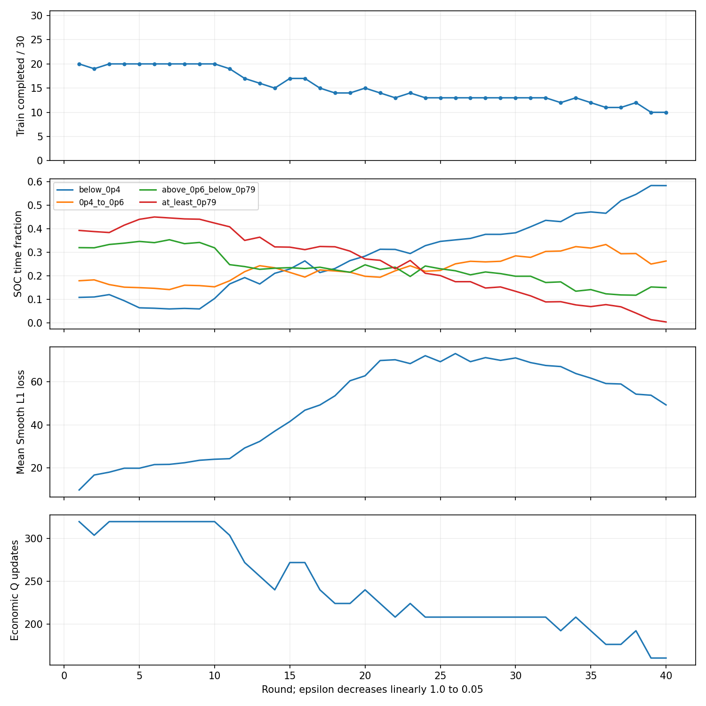
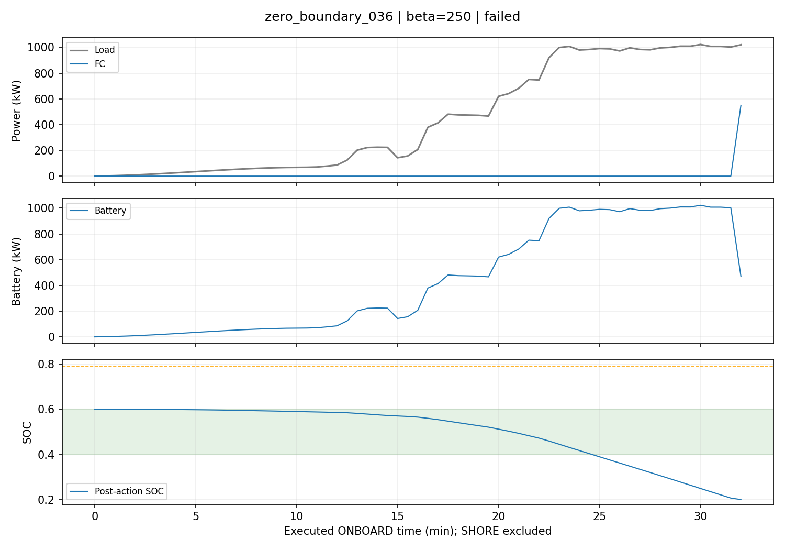
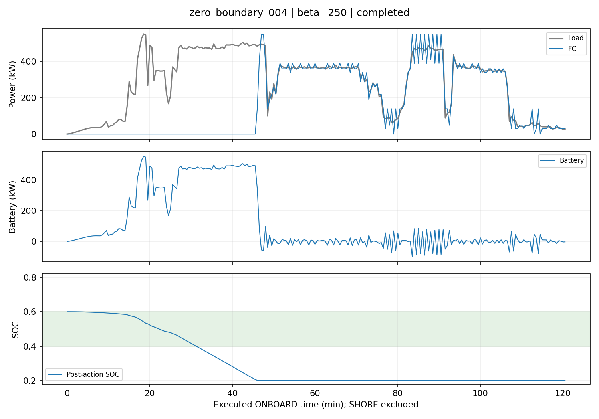

# v4 β=250：40 轮固定配置复核（2026-10-07）

本次训练完整执行了 40 轮，最终 greedy Train 为 **10/30**、Validation 为 **4/8**。没有保持 5 轮筛选的 30/30、8/8，因此未生成正式 `selected_agent.pt`；本地只保留 `diagnostic_final_agent.pt` 供 Train/Validation 回放。Test payload 打开数为 **0**，训练前后正式数据 manifest 哈希相同。

代码提交：`db3972079e091f8d49044471b4734e6f7c802fcd`。原始训练报告见 [JSON](results/v4_beta250_40r_seed42.json)，每轮数值见 [CSV](results/v4_beta250_40r_seed42_rounds.csv)。完整本地输出与每 50 步日志位于 `outputs/v4_beta250_40r_seed42/`。

## 配置与 reward

固定 β=250、rounds=40、seed=42、ε=1.0→0.05、batch=64。保持 8-128-64-61 MLP、FC 动作 0–600 kW/10 kW、gamma=1、Adam 1e-4、replay=100,000、梯度范数上限 10。每完成一个训练样本进行 16 次经济 Q 更新；失败样本不触发经济 Q 更新。target 在初始化、预填充之后以及每轮结束时硬复制。结果网络仍仅做诊断，不参与选动作。未启用 KAN，没有更改更新频率或 target 调度。

普通 ONBOARD reward：

```text
r_k = -(C_H2,k + C_FC_deg,k + C_Bat_deg,k + 250 * phi(SOC_k+1))
phi(s) = (0.4-s)^2 if s<0.4; 0 if 0.4<=s<=0.6; (s-0.6)^2 if s>0.6
```

使用动作后的实际 SOC。最后一步另按既有规则计入后续真实岸电，或没有真实岸电时的 MODELED terminal settlement；SHORE 不加 SOC 软惩罚。保留硬 SOC [0.2,0.8] 和单步 action mask。没有 Cscale 或额外 FC 波动罚项。

## 最终 greedy 评估

| 指标 | Train | Validation |
| --- | ---: | ---: |
| 完成 | 10/30（33.33%） | 4/8（50%） |
| 已完成样本实际账本/元 | 35,000.46 | 17,655.35 |
| 已完成样本模拟末端结算/元 | 3,791.09 | 1,409.92 |
| 已完成样本可比费用/元 | 38,791.55 | 19,065.27 |
| 已完成样本 SOC soft penalty/元 | 24,227.56 | 8,078.76 |
| 全部执行步骤 soft penalty，含失败前缀/元 | 42,843.83 | 9,297.68 |
| 实际执行的最小动作后 SOC，含失败前缀 | 0.20000048 | 0.20000012 |
| 已完成样本平均终端 SOC | 0.2231 | 0.2485 |
| 已完成样本终端 SOC 范围 | 0.2000–0.3717 | 0.2002–0.3930 |

这些费用只覆盖已完成样本。由于有失败，**完整 Train/Validation 的可比总费用均为 null**；不能把已完成子集的费用当作全体航段的经济性。SOC 软惩罚从未计入实际费用或可比经济费用。末端模拟结算不改变实际终端 SOC。

Validation 已完成 `zero_boundary_004/009/032/043`；失败为 `010`（row188）、`019`（row175）、`036`（row72）、`047`（row74），原因全部是当前电池功率与下一步 SOC 边界下无可行 FC 动作。

已完成 Validation 的实际费用分项：氢耗 1,694.75 元、FC 退化 14,869.99 元、电池退化 635.01 元、真实岸电购电 455.60 元。模拟结算另外包含网电 1,015.99 元和充电退化 393.93 元；两套账本没有重复计费。

## SOC 时间分布

按每个实际执行 30 s ONBOARD 区间的动作后 SOC 统计，包含失败前缀；不含 SHORE、未执行的失败后缀和虚拟末端充电。SOC=0.4、0.6 归工作区间，SOC=0.79 归最高档。

| 范围 | SOC<0.4 | 0.4≤SOC≤0.6 | 0.6<SOC<0.79 | SOC≥0.79 |
| --- | ---: | ---: | ---: | ---: |
| 40轮探索 | 25.95% | 21.94% | 24.42% | 27.69% |
| 最终greedy Train | 63.94% | 36.06% | 0.00% | 0.00% |
| 最终greedy Validation | 61.92% | 38.08% | 0.00% | 0.00% |

训练探索中仍出现高 SOC，但最终 greedy 策略没有 SOC>0.6 的执行步骤。最终问题转为低 SOC：Train/Validation 约 64%/62% 的实际执行时间低于 0.4。最终 FC=0 的步骤占比约为 Train 69.35%、Validation 58.91%；先过度使用电池，接近下限后才由 mask 强制选择正 FC，部分高负载航段已无法继续。

## 执行与优化计数

| 计数 | 实测值 |
| --- | ---: |
| 40轮样本尝试 | 1,200 |
| 探索中完成尝试 | 607（50.58%） |
| 40轮实际 ONBOARD environment transitions | 410,814 |
| 预填充实际 ONBOARD transitions | 18,273 |
| 学习阶段合计 transitions（含预填充） | 429,087 |
| 最终 greedy Train+Validation transitions | 9,900 |
| 上述训练与评估合计 transitions | 438,987 |
| 额外只读轨迹复放 transitions，不进训练 | 9,900 |
| 包含该复放的全部记录步骤 | 448,887 |
| 经济 Q optimizer updates（预填充） | 464 |
| 经济 Q optimizer updates（40轮） | 9,712 |
| 经济 Q optimizer updates（总计） | 10,176 |
| 独立结果网络 optimizer updates | 19,680 |
| target 硬复制次数，含初始化 | 42 |
| target 复制次数，不含初始化 | 41 |
| 累计保留失败尝试前缀 | 89,115 |

训练期约 **42.30 个执行步骤 / 经济 Q optimizer update**。每批仍采样 64 条，不能把该比值直接解释成每条样本训练次数。失败尝试前缀主要用于独立结果网络；未完成航段仍不进入经济 TD 回放。单个长航段和短航段都只在完成后触发 16 次更新；随着完成率下降，每轮经济 Q 更新从早期 320 次降为末期 160 次。预填充、探索、greedy 评估和额外轨迹复放已分开计数；SHORE 与虚拟岸充不是 DQN transition。

训练、预填充与最终 greedy 评估用时 16.81 分钟，不包含额外轨迹复放及绘图。计数来自实际执行和 optimizer/target 调用，没有用完整数据长度估算失败后的步骤。

## 每轮 Train 完成率

这张表是 epsilon-greedy 探索的完成率，最终 greedy 指标单列于上文。ε 的变化影响轨迹，不能将它当作逐轮相同策略的独立评估。

| 轮次 | ε | 完成 | 完成率 | 实际执行步数 | 经济Q更新 | mean TD loss |
| ---: | ---: | ---: | ---: | ---: | ---: | ---: |
| 1 | 1.0000 | 20/30 | 66.7% | 12,562 | 320 | 9.58 |
| 2 | 0.9756 | 19/30 | 63.3% | 12,373 | 304 | 16.57 |
| 3 | 0.9513 | 20/30 | 66.7% | 12,529 | 320 | 17.89 |
| 4 | 0.9269 | 20/30 | 66.7% | 12,694 | 320 | 19.74 |
| 5 | 0.9026 | 20/30 | 66.7% | 12,697 | 320 | 19.73 |
| 6 | 0.8782 | 20/30 | 66.7% | 12,731 | 320 | 21.43 |
| 7 | 0.8538 | 20/30 | 66.7% | 12,666 | 320 | 21.53 |
| 8 | 0.8295 | 20/30 | 66.7% | 12,639 | 320 | 22.29 |
| 9 | 0.8051 | 20/30 | 66.7% | 12,728 | 320 | 23.45 |
| 10 | 0.7808 | 20/30 | 66.7% | 12,570 | 320 | 23.92 |
| 11 | 0.7564 | 19/30 | 63.3% | 12,088 | 304 | 24.19 |
| 12 | 0.7321 | 17/30 | 56.7% | 11,771 | 272 | 29.18 |
| 13 | 0.7077 | 16/30 | 53.3% | 11,418 | 256 | 32.25 |
| 14 | 0.6833 | 15/30 | 50.0% | 10,848 | 240 | 37.04 |
| 15 | 0.6590 | 17/30 | 56.7% | 11,743 | 272 | 41.51 |
| 16 | 0.6346 | 17/30 | 56.7% | 11,728 | 272 | 46.80 |
| 17 | 0.6103 | 15/30 | 50.0% | 10,909 | 240 | 49.24 |
| 18 | 0.5859 | 14/30 | 46.7% | 10,273 | 224 | 53.53 |
| 19 | 0.5615 | 14/30 | 46.7% | 10,329 | 224 | 60.55 |
| 20 | 0.5372 | 15/30 | 50.0% | 10,891 | 240 | 62.86 |
| 21 | 0.5128 | 14/30 | 46.7% | 10,722 | 224 | 69.98 |
| 22 | 0.4885 | 13/30 | 43.3% | 8,608 | 208 | 70.35 |
| 23 | 0.4641 | 14/30 | 46.7% | 10,281 | 224 | 68.54 |
| 24 | 0.4397 | 13/30 | 43.3% | 8,572 | 208 | 72.23 |
| 25 | 0.4154 | 13/30 | 43.3% | 8,662 | 208 | 69.43 |
| 26 | 0.3910 | 13/30 | 43.3% | 8,659 | 208 | 73.23 |
| 27 | 0.3667 | 13/30 | 43.3% | 8,564 | 208 | 69.45 |
| 28 | 0.3423 | 13/30 | 43.3% | 8,645 | 208 | 71.35 |
| 29 | 0.3179 | 13/30 | 43.3% | 8,634 | 208 | 70.07 |
| 30 | 0.2936 | 13/30 | 43.3% | 8,526 | 208 | 71.19 |
| 31 | 0.2692 | 13/30 | 43.3% | 8,616 | 208 | 69.02 |
| 32 | 0.2449 | 13/30 | 43.3% | 8,530 | 208 | 67.68 |
| 33 | 0.2205 | 12/30 | 40.0% | 8,415 | 192 | 67.17 |
| 34 | 0.1962 | 13/30 | 43.3% | 8,506 | 208 | 63.92 |
| 35 | 0.1718 | 12/30 | 40.0% | 8,407 | 192 | 61.76 |
| 36 | 0.1474 | 11/30 | 36.7% | 8,220 | 176 | 59.26 |
| 37 | 0.1231 | 11/30 | 36.7% | 8,207 | 176 | 59.03 |
| 38 | 0.0987 | 12/30 | 40.0% | 8,389 | 192 | 54.30 |
| 39 | 0.0744 | 10/30 | 33.3% | 8,143 | 160 | 53.79 |
| 40 | 0.0500 | 10/30 | 33.3% | 7,321 | 160 | 49.27 |



## 代表性轨迹与判断

`zero_boundary_036` 在失败前几乎全程选 FC=0，负载升到约 1000 kW 后仍主要由电池供电；接近 SOC 0.2 才被即时 mask 迫使提高 FC，下一状态已无可行动作。



`zero_boundary_004` 虽然完成，也长期位于 SOC 工作区间下方；“成功跑完”与“保持工作区间”是不同指标。



全部 8 个 Validation 和 2 个 Train 代表图已保存在 `docs/figures/v4_beta250_40r_seed42/`。

当前证据表明：β=250 的短训练完成率提升不稳定，完整 40 轮后未改善 10/30、4/8 的完成率门槛；最终 SOC 贴上限的问题消失，但低 SOC 和供电失败仍严重。mean TD loss 从 9.58 上升到第26轮的 73.23，最后为 49.27；这不单独证明数值发散或欠训练，因为目标网络和采样轨迹都在变化。完成率与经济更新预算同时下降，则明确显示当前完成后更新的调度存在反馈耦合。

本次不能唯一归因于更新次数不足：失败信息仍不直接影响经济 Q 动作排序，且 epsilon 日程拉长、长航段信用分配及已有状态信息也可能影响结果。需要下一阶段在固定其余条件下比较按有效 transitions 调度更新与按 optimizer 次数同步 target，才能判断调度的效果。本次**未修改**更新频率或 target 同步方式，也未追加新机制或调 β。

相关验证：54 项测试、22 项子测试通过；最终计数补充后的 4 项诊断测试另行通过。与 `ab81759` 的短轨迹对照，在线/目标/结果模型权重、回放条目和两个随机数状态逐项相同；这次增加的诊断没有改变算法行为。全量运行后又核验了配置、计数守恒、经济费用与软惩罚分离、轨迹一致性和 Test 封存。
