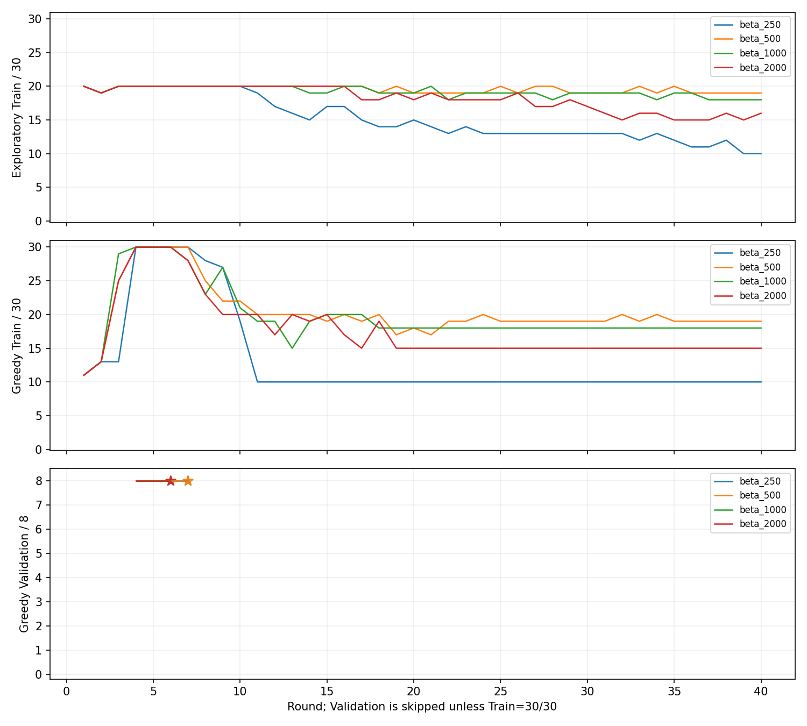
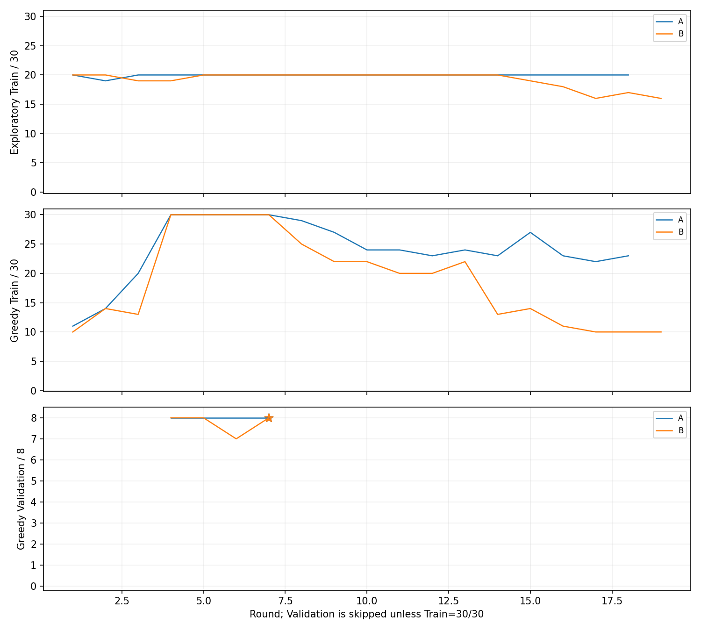

# v4：SOC 惩罚与更新调度的分阶段对照（2026-10-08）

## 固定条件与选模口径

**状态：已按用户要求暂停，训练进程已停止。** 阶段1完成；阶段2 A/B分别完成18/19轮后中断，C未运行。本次归档没有继续训练或新增模型评估。

实验源码提交为 `b35c8408ad1258c089dcc72df9a7c0e5e285d4f5`。每个配置从 seed=42 独立初始化，最多 40 轮；不从其他配置或历史最佳模型续训。固定 MLP 8-128-64-61、61 个 FC 动作（0–600 kW，步长 10 kW）、gamma=1、batch=64、Adam 学习率 1e-4、replay 容量 100,000、梯度范数上限 10、epsilon 按轮线性从 1 降至 0.05。CPU Torch 线程配置保留 16，没有启用 KAN。

每轮探索训练结束后，以 epsilon=0 重放全部 30 个 Train 样本；仅在 Train=30/30 时重放全部 8 个 Validation 样本。评估不写入 replay、不更新网络，并恢复训练 RNG。Validation 跳过轮次记为 null，不视为 0/8；不完整数据集合的可比总费用也记为 null。

checkpoint 必须同时满足 greedy Train=30/30、Validation=8/8。只用 Validation 可比经济费用选择历史最佳合格轮次；费用不含 SOC 软惩罚。保存后再独立重放 Train/Validation，核对完成率及费用。第 40 轮只表示预算终点，不代表最终选定模型。

## Reward 与账本

普通 ONBOARD 决策步使用动作执行后的真实 SOC：

```text
phi(s) = (0.4-s)^2, s<0.4
         0,           0.4<=s<=0.6
         (s-0.6)^2, s>0.6

r = -(C_H2 + C_FC_deg + C_Bat_deg + beta_soc*phi(SOC_next))
```

既有真实 SHORE 结算和 MODELED terminal settlement 在相应航段末步归账；真实费用仍为 H2、FC 退化、Battery 退化及岸电购电四项，必要的模拟补能及充电退化另列。SOC 软惩罚仅进入 ONBOARD reward，单独统计，不计入实际或可比经济费用。没有增加 FC 波动惩罚、SOC 终端硬目标或 Cscale。单步 action mask 和 SOC 硬边界 [0.2,0.8] 不变。

失败经验的经济 replay 语义保持不变：已完整结束的 voyage 前缀可进入经济 replay，失败的未完成后缀进入独立 outcome replay；outcome 模型不参与动作选择。本次未新增失败罚款或风险动作过滤。

## 两阶段协议

阶段 1 比较 beta_soc=250、500、1000、2000，保持每完成样本 16 次经济 Q 更新；target 在初始化、预填充后及每轮结束复制。阶段 1 全部结束后，只从合格模型中按最低 Validation 可比费用选择 beta。

阶段 2 固定该 beta，从相同 seed 新初始化比较：

| 配置 | 经济 Q 更新额度 | Target |
| --- | --- | --- |
| A | 每完成样本 16 次 | 每 1,000 次实际经济 optimizer update |
| B | 每累计 16 条新进入经济 replay 的 transition，1 次 | 同上 |
| C | 每累计 8 条新进入经济 replay 的 transition，1 次 | 同上 |

B/C 按累计插入数计数，FIFO 满容量后继续计数；未用余数跨样本/轮次保留。额度包括预填充中新进入 replay 的数据，实际更新次数与预填充贡献分列。数据仍按既有样本回放后批量入库，更新额度按实际入库数兑现，没有改成逐个物理步在线入库。target 初始化复制单列，阶段 2 不再额外按轮或预填充结束同步。A 的 target 也采用同一规则，因此阶段 2 A 与阶段 1 的差别是 target 调度，阶段 2 A/B/C 的差别才是更新频率。

## 统计定义与执行记录

SOC 四档、平均/最低 SOC、FC=0 比例均按实际执行的 30 s ONBOARD 动作后状态统计，包含失败前缀，不含 SHORE 或模拟充电。平均终端 SOC 仅对完成样本计算。environment transitions、经济 replay 新插入条目及经济 optimizer updates 分开计数；监控重放不计入训练量。

最初四 worker 同时启动时，beta=250、1000 在数据校验阶段内存不足，尚无预填充或探索步骤。错误日志独立保留；500、2000 的完整训练结果保留。随后改为直接启动 worker，减少调度进程加载 Torch 的额外内存；250、1000 从同一初始 seed 正式重跑，各自仍仅训练 40 轮。线程配置、数据、学习算法及超参数均未改变。

正式实验不打开 Test payload，不改数据或划分；每组记录数据 manifest 哈希及 Test 打开计数。

交互中断随后结束了 250、1000 的前台 worker，分别留下 14、11 个完整轮次。原 runner 未保存 optimizer/replay/RNG 恢复状态，因此将中断文件按哈希核验后移至 `interruptions/`，从相同 seed 重建同一训练前缀，逐轮核对，再继续至第 40 轮。后续 worker 改为隐藏后台进程。每个最终模型仍仅沿一条 40 轮轨迹学习；中断尝试的重复计算在执行审计中另列，未完成轮次的物理步骤只能由日志确定下界，不伪造精确总数。

## 阶段 1 结果

每组均完成 40 轮；各组最佳模型均经独立 Train/Validation 重放核验，全体 formal run 的 Test payload 打开数为 0，manifest 未变。

| beta | 合格轮次 | 最佳轮次 | 最佳 Train / Validation | Validation 实际账本 / 元 | MODELED 结算 / 元 | 可比费用 / 元 | 第40轮 Train |
| --- | --- | ---: | --- | ---: | ---: | ---: | --- |
| 250 | 4,5,6,7 | 7 | 30/30, 8/8 | 37,801.11 | 45.88 | 37,846.99 | 10/30 |
| 500 | 4,5,6,7 | 7 | 30/30, 8/8 | 36,509.34 | 44.29 | **36,553.63** | 19/30 |
| 1000 | 4,5,6 | 6 | 30/30, 8/8 | 43,364.64 | 45.75 | 43,410.39 | 18/30 |
| 2000 | 4,5,6 | 6 | 30/30, 8/8 | 40,606.16 | 44.20 | 40,650.36 | 15/30 |

第40轮四组均不满足 Train 门槛，Validation 全部跳过。表内 Validation 费用来自各自最佳合格轮次。每轮完整值见 [结果目录](results/v4_staged_beta_cadence_seed42/)，下图空白表示跳过评估。



按指定规则固定 beta=500 进入阶段2。该组第7轮最佳模型的 Train/Validation SOC>=0.79 占比分别为 84.39%/73.26%，平均动作后 SOC 为 0.7818/0.7623；完成资格已达到，高 SOC 贴边仍明显。

全部四组都出现早期合格、后期退化。beta=250 的全部40轮探索完成数、实际执行步骤、实际费用、modeled费用、软惩罚和SOC分布与上一轮固定配置复核逐项一致。中断恢复的14/11轮记录和两份最佳 checkpoint 文件均完全一致，见 [恢复审计](results/v4_staged_beta_cadence_seed42/reconstruction_audit.json)。

## 阶段 2 结果

固定 beta=500。以下是暂停时已经完成监控的轮次；末列表示这些完整轮次的 greedy Train，不代表第40轮结果。

| 配置 | 完整轮次 | 最佳轮次 | 最佳 Train / Validation | 最佳 Validation 实际账本 / 元 | MODELED 结算 / 元 | 可比费用 / 元 | 最后完整轮次 Train |
| --- | ---: | ---: | --- | ---: | ---: | ---: | --- |
| A：16 updates/completed episode | 18/40 | 7 | 30/30, 8/8 | 40,629.82 | 45.30 | 40,675.12 | 23/30 |
| B：1 update/16 replay insertions | 19/40 | 7 | 30/30, 8/8 | 44,179.75 | 49.93 | 44,229.68 | 10/30 |
| C：1 update/8 replay insertions | 0/40，未运行 | — | — | — | — | — | — |

A最后完整轮次的探索完成数为20/30，B为16/30；两组该轮Validation均按资格规则跳过。A在第19轮暂停，日志最后记录 `progress step=238650`；B在第20轮暂停，最后记录 `progress step=245400`。这些日志值不是中断轮次的精确执行/更新总数。



暂停前完整轮次均已出现早期可行、后期完成率下降。A第18轮greedy Train中，SOC>=0.79占56.35%、SOC<0.4占5.22%、FC=0占37.86%；B第19轮SOC<0.4占63.94%、FC=0占75.74%。A/B最佳模型的Validation中SOC>=0.79仍分别占73.35%/72.62%。这些现象不能证明某种调度解决了训练稳定性问题。

三组更新调度没有完成对照，当前不据此推荐最终cadence，也不宣称已满足进入KAN对照的条件。阶段1按既定规则选择的beta=500仅对应该阶段最低合格Validation费用。

## 执行计数与归档

以下计数采用各组最后完整监控轮次。训练列不含bootstrap和greedy评估；target列包含初始化复制。阶段2中断轮次的额外计算保留在日志中，未并入下表。

| 配置 | 训练 environment transitions | Bootstrap | Greedy评估 transitions | Economic replay 插入 | Economic optimizer updates | Target copies |
| --- | ---: | ---: | ---: | ---: | ---: | ---: |
| beta250，40轮 | 410,814 | 18,273 | 395,217 | 350,356 | 10,176 | 42 |
| beta500，40轮 | 498,492 | 18,273 | 531,584 | 460,325 | 12,976 | 42 |
| beta1000，40轮 | 494,377 | 18,273 | 521,114 | 456,055 | 12,752 | 42 |
| beta2000，40轮 | 479,409 | 18,273 | 492,714 | 436,465 | 12,080 | 42 |
| A，18轮 | 228,420 | 18,273 | 284,550 | 219,216 | 6,208 | 7 |
| B，19轮 | 234,721 | 18,273 | 245,483 | 223,642 | 13,977 | 14 |

各阶段1最佳模型独立轨迹复核另执行21,709步/组，未计入训练量。阶段2保存的是第7轮合格online模型权重；中断后未新增独立轨迹复核，也没有保存optimizer/replay/RNG恢复状态。不能把这些权重当成原运行的可恢复训练快照。

全部现存实验文件（包括中断尝试、资源错误日志、逐轮JSON/CSV、六份合格权重及已有FC/Battery/SOC轨迹）保存在[完整原始归档](results/v4_staged_beta_cadence_seed42/raw/)，逐文件SHA256见[归档清单](results/v4_staged_beta_cadence_seed42/raw_archive_inventory.json)。[暂停汇总](results/v4_staged_beta_cadence_seed42/study_summary.json)明确区分完整、部分完成及未运行状态。归档时再次核验数据manifest哈希与四组完整实验一致；报告记录Test打开数均为0。

提交前相关定向测试：117 passed、330 subtests passed；本次没有修改网络、reward、超参数或数据划分。
